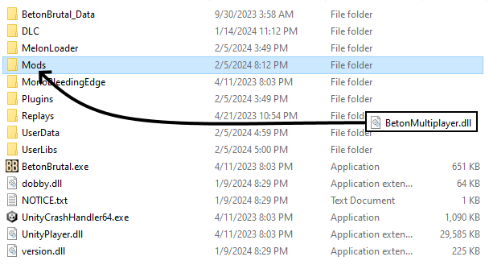
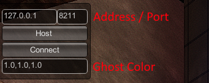
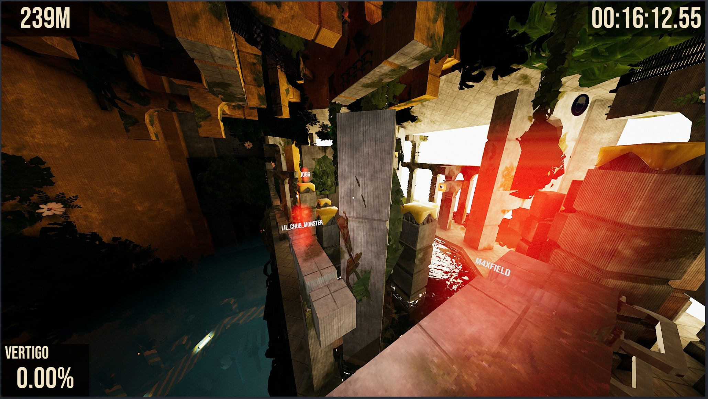

## Beton Multiplayer

This is a multiplayer mod for the game BETON BRUTAL. 

It uses P2P hosting, so you'll need to portforward or use a online LAN client like [Hamachi](https://vpn.net/). 

It was made using [MelonLoader](https://github.com/LavaGang/MelonLoader) see here for more information.

You can install this mod by getting the latest release [here](https://github.com/sethpotter/BetonMultiplayer/releases) then dragging it into your mods folder.

**If the mods folder does not exist you must create one.**

Once you've installed the mod, **press the M key** to pull up the multiplayer menu.

You can join friends or host a server from here.

You can modify the hosting address by changing the IP then clicking the Host button.

**The host should use 127.0.0.1, while the person connecting uses the host's ip address!**

To join someone change the address to your friends IP address then click Connect.

If you are having trouble, it may be because a firewall issue between the host and client or the host may have issues with portforwarding. 
Be sure the port you are using is portforwarded properly! If you are using Hamachi this is not a concern.

If you cannot see someone or are experiencing desync issues. The client should **press the G key** to resync with the host.

If you encounter any problems or have suggestions feel free to let me know at my discord **@dc_thunder** or in the issues section.

Good luck and have fun!